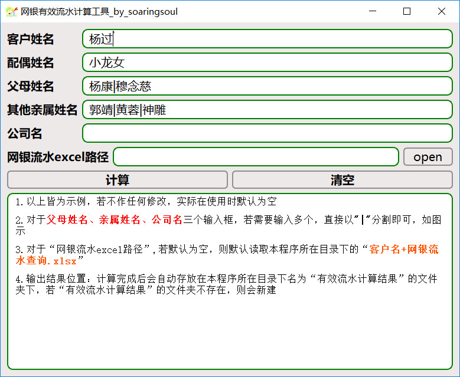
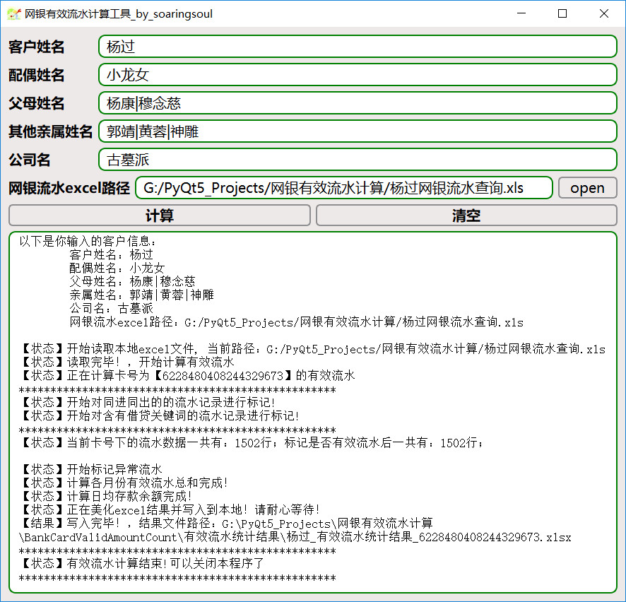
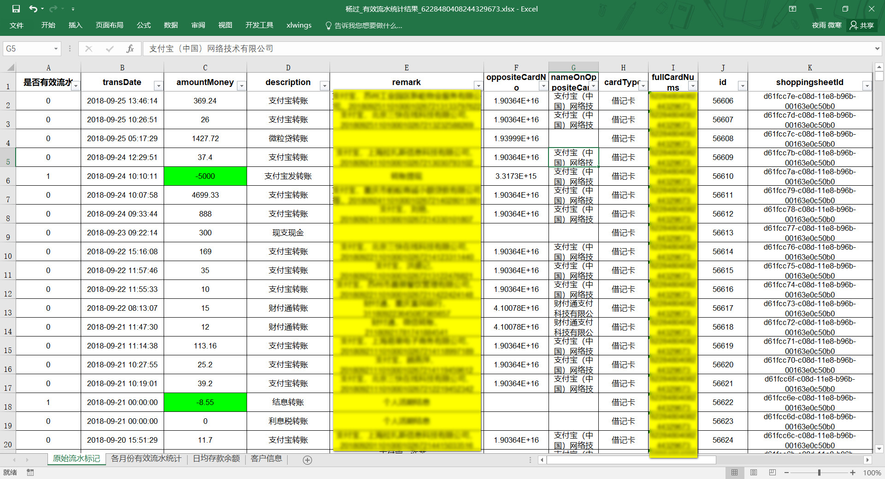
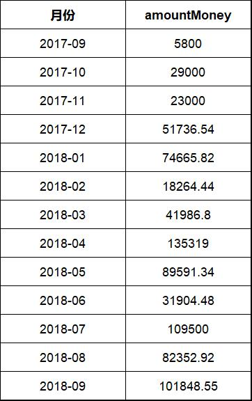

# BankCardValidAmountCount
根据银行提供的网银流水记录文件（excel格式）计算其有效流水，以用于评估其收入。
## 一 网银流水有效流水计算规则

### 1 排除同进同出
前后一小时内，remark列或者nameOnOppositeCard列中进项账户与出项账户不能为同一主体。在该时间内，如果进项账户与出项账户为同一主体，则进项流水不算入有效流水。
注意：
* 若remark为空, 对remark不做判断。
* 若nameOnOppositeCard为空, 对nameOnOppositeCard不做判断。

###  2 排除借贷
需要排除的关键词：['借款', '贷款', '冲正', '消费退货', '放款', '透支回补', '钱生钱C', '退款', ‘赔款’,‘和融通’, ‘微粒贷’, ‘借呗’, ‘冲账’, '海科融通','和融' ，'陆金所'，'拍拍贷'，'上海陆家嘴国际金融资产交易市场股份有限公司']。
排除remark、nameOnOppositeCard、description及transAddr中含有以上关键词的记录，标记为无效流水
### 3 排除同名转账
#### 3.1 remark、nameOnOppositeCard以及transAddr 中，将含关键字“客户名/配偶名/客户公司名/客户公司股东姓名 |指定客户亲属姓名”字样标记为无效流水

#### 3.2 description列中若含有"客户名+支付信转账"，则判定为无效流水

### 4 排除所有支出项（正值为支出）
将amountMoney中所有正值标记为无效流水

### 5 支付宝/微信流水处理
将被标记为无效流水的Description、remark、nameOnOppositeCard以及transAddr中含“支付宝转账提现/微信零钱提现”的全部标记为有效流水。
### 6 按月计算收入总和
统计各月份有效流水的总和
### 7 日均存款余额
每季度（3/6/9/12）21日-25日，“description”列中含“结息”、“利息”，“季息” 字样，且金额小于0，将四个季度结息金额算平均数后乘以1100，得出结果为日均存款余额
## 二 打开和运行界面
本程序依赖包如下：

openpyxl==2.2.5

pandas==0.23.4

PyQt5==5.11.2

PyQt5-sip==4.19.12

python-dateutil==2.7.3

QScintilla==2.10.7

StyleFrame==1.6.2

xlrd==1.0.0

直接执行  *`pip install -r requirements.txt`*  安装即可

### 1 打开界面， 执行【python run.py】或者【直接打开启动网银有效流水计算.bat】
* 注意：linux系统 只能执行 python run.py
### 安装依赖

### 2 运行时界面

### 3 结果文件
* 原流水标记sheeet:
会将对有效流水的记录进行标记：将有效记录的amountMoney列标记为绿色

* 各月份有效流水统计

* 日均存款余额统计

* 客户信息

